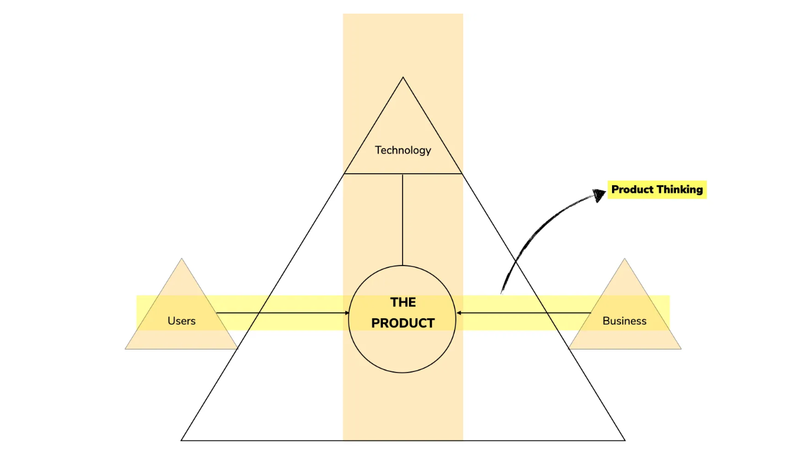
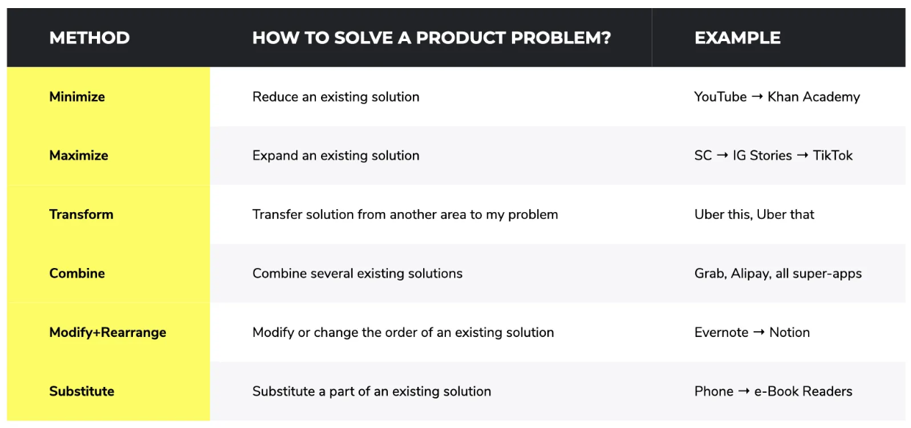

Product thinking
==
A product can be defined as the result of the processes between users (what they need → problem space), business (what they can give → solution space) and the bridge that connects these two entities together, technology.

Product thinking is the journey from the problem space of the users to the solution space of the business. The goal of this journey is to reduce the gap between users and the business.

## Why is product thinking important
- To achieve the product-market fit
- To make sure business is not delivering Y when users need X

## Rules of product thinking
- Love the problem not the solution
- Think in products, not in features
- Make products more meaningful with product thinking

## How to cultivate product thinking

### Problem Space Tool #1: 5W1H (What, Who, Why, Where, When, & How). 
An important aspect of these questions is when and how to use them. If you want to think ‘divergently’ or to expand your problem statement, then use why and what more frequently in your line of questioning. If you want to think ‘convergently’ or to narrow down solution options then use how, who, when, where more frequently.

### Problem Space Tool #2: Mom’s Test (Foolproof your questions). 
Mom’s test is all about a set of simple rules for crafting good questions that even your mom can’t lie to you about. For example, if you are interviewing a user about their fitness habits instead of asking “Do you go to a gym to keep yourself fit?” → this line of questioning can invite a lot of bias in the answer and the user can potentially lie based on his/her insecurities and guilt. According to Mom’s test, you should simply ask — “How many times did you go to the gym last week?” the chance of getting an honest unbiased answer goes up with this line of questioning.

### Problem Space Tool #3: Jobs-to-be-done (JTBD)
The idea is simple, when you try to understand the problem space, start with the question — “What job(s) arise(s) in people’s lives that your product could solve?” This question helps you get started on the current user journey, empathizing, understanding the problem, the current solutions, and the gaps.

Now that we have the tools to understand the problem space better which helps you spot the opportunity or gap in a system, let us get into the solution space and the tools.

### Solution Space Tool #1: Get better at constructing hypothesis statement
A good hypothesis statement is the ultimate testimony of your problem space understanding. But first, what is a hypothesis? The best definition I found that seems to capture the essence of the word hypothesis is this → “A hypothesis is a testable explanation of an idea”

A sample template for hypothesis driven development:
"We believe that **building this product**, **for these people**, will achieve **this outcome**. We will know if we are successful when we see **this signal from the market**"

### Solution Space Tool #2: Get creative with problem solving
Below are six generic proven models that you could use as a starting point for solutioning.

### Solution Space Tool #3: Start focusing on the outcome and not output
As a product thinker or product manager, you should start focusing on the outcome rather than output, the value you are generating versus estimation of development effort, and the accuracy of the product to do a job versus simplicity.

## Resources
- https://uxplanet.org/product-thinking-101-1d71a0784f60 (this page is summary of the article)
- [Radical Product Thinking book](https://www.oreilly.com/library/view/radical-product-thinking/9781523093335/)
- [Jobs to be done book](https://www.oreilly.com/library/view/jobs-to-be/9780814438084/)
